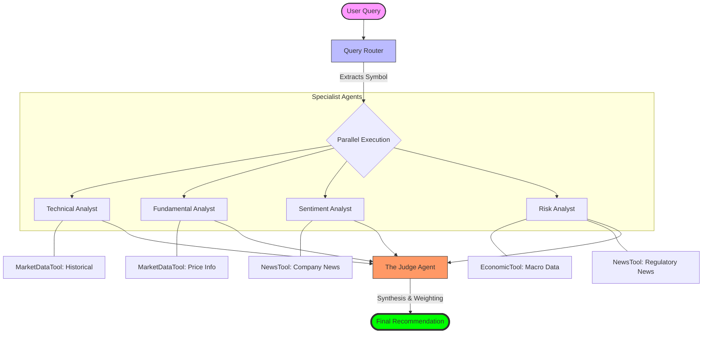

# Agent Workflow & Flowchart

This document visualizes the internal process of the Invest Today platform, from user query to final recommendation.

## User Flow Diagram

The following Mermaid diagram illustrates how the Query Router orchestrates specialized agents and how they interact with tools.

## Step-by-Step Orchestration

1.  **Query Router**: Uses regex to extract the stock ticker from the user's natural language input (e.g., "Should I buy RELIANCE?").
2.  **Parallel Analysts**:
    *   **Technical**: Analyzes OHLCV data to find trends (SMA, RSI, MACD).
    *   **Fundamental**: Evaluates valuation metrics (P/E, ROE, Debt/Equity).
    *   **Sentiment**: Scores news headlines to gauge market mood.
    *   **Risk**: Combines macro data (RBI rates, Inflation) with specific regulatory news (SEBI).
3.  **The Judge**: Synthesizes conflicting analyst views (e.g., Bullish Technicals vs. Risky Macro) into a single, decisive output.
4.  **Final Output**: Returns a recommendation (Buy/Hold/Sell), Confidence Score, and the "Bottom Line".
